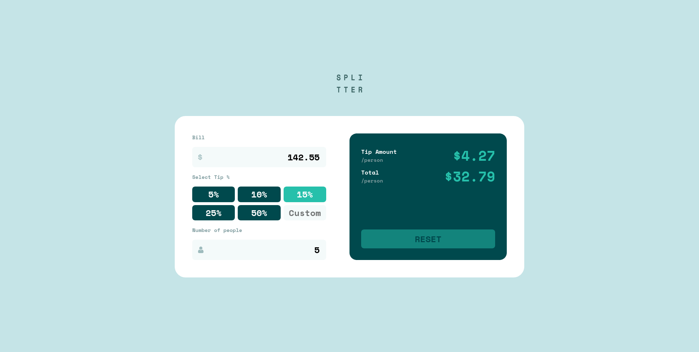
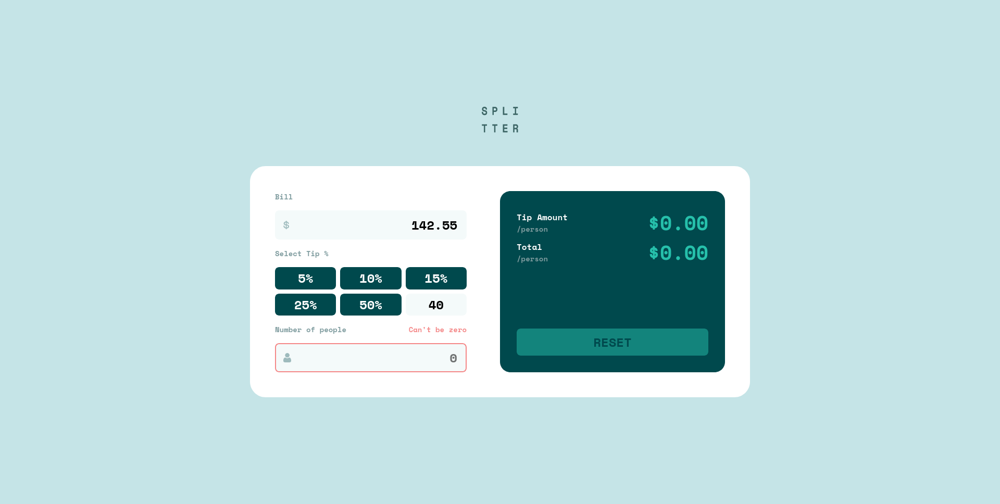

# Tip calculator app

My solution for the [Tip calculator app challenge on Frontend Mentor](https://www.frontendmentor.io/challenges/tip-calculator-app-ugJNGbJUX) using *React*.

## Table of contents

- [Overview](#overview)
  - [The challenge](#the-challenge)
  - [Screenshot](#screenshot)
  - [Links](#links)
- [My process](#my-process)
  - [Built with](#built-with)
  - [What I learned](#what-i-learned)
- [Author](#author)

## Overview

### The challenge

Users should be able to:

- View the optimal layout for the app depending on their device's screen size
- See hover states for all interactive elements on the page
- Calculate the correct tip and total cost of the bill per person

### Screenshot

<table>
        <tr>
            <td>
                
            </td>
		    <td>
                
            </td>
            <td>
                
            </td>
        </tr>
</table>

### Links

- Solution URL: [https://www.frontendmentor.io/solutions/tip-calculator-app-4CvTo2Ofw7](https://www.frontendmentor.io/solutions/tip-calculator-app-4CvTo2Ofw7)
- Live Site URL: [https://tip-calculator-gmaitor.vercel.app/](https://tip-calculator-gmaitor.vercel.app/)

## My process

### Built with

- Semantic HTML5 markup
- CSS custom properties
- Flexbox
- CSS Grid
- Mobile-first workflow
- [React](https://reactjs.org/) - JS library
- [Vite](https://vitejs.dev/) - Build tool

## Author

- Frontend Mentor - [@AitorGallardo](https://www.frontendmentor.io/profile/AitorGallardo)

